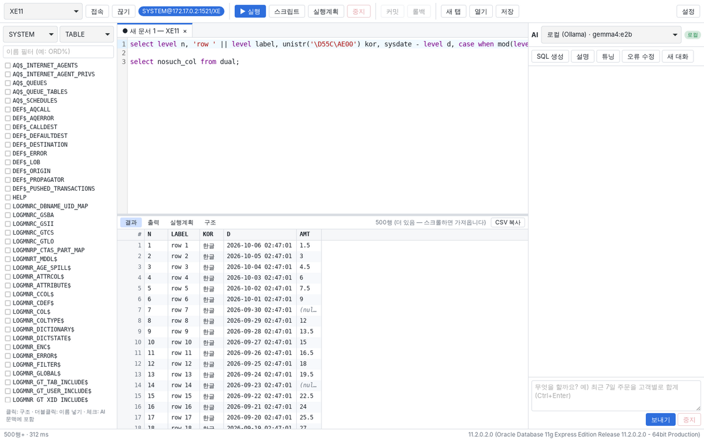
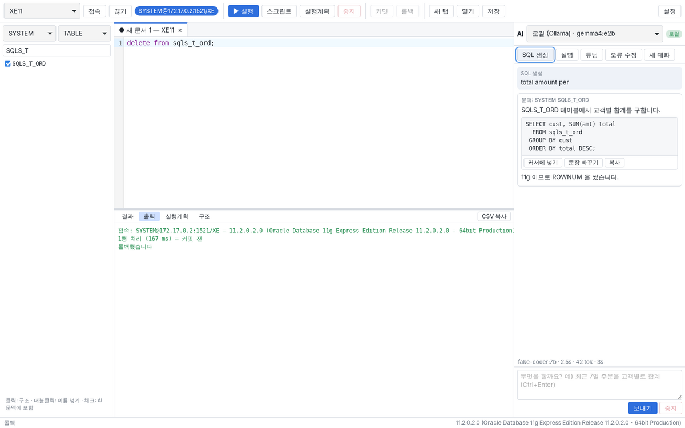
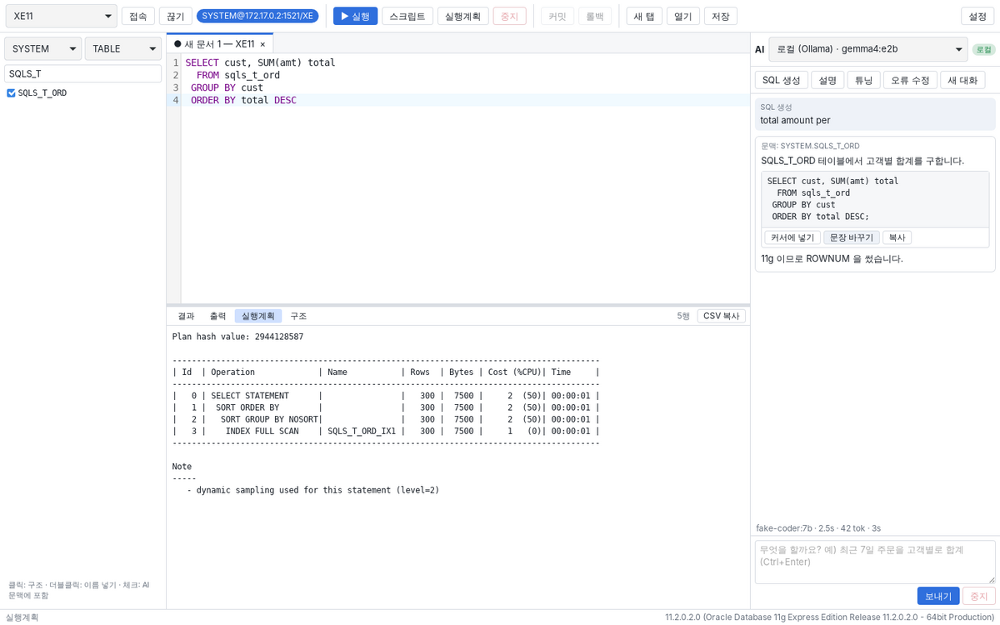

# SQLStudio

Oracle 중심의 데스크톱 SQL 에디터. Toad 처럼 쓰고, 옆에 AI 가 붙어 있다.
AI 는 로컬 LLM(Ollama, LM Studio, vLLM)과 프론티어 모델(Claude, OpenAI 등)을 골라 쓰고,
내장 MCP 서버로 다른 AI 에이전트(Claude Desktop, Claude Code, Cursor)에 스키마 정보를 연다.

| 결과 그리드 | AI 패널 | 실행계획 |
|---|---|---|
|  |  |  |

<sub>화면은 Oracle 11g XE 에 붙인 실제 앱이다. AI 답은 테스트용 가짜 모델이 낸 것이다.</sub>

---

## 세 가지 원칙

### 1. AI 는 SQL 을 실행하지 않는다

- 앱 안의 AI 는 SQL 을 **제안만** 한다. 사람이 "커서에 넣기 / 문장 바꾸기"로 에디터에 옮기고,
  읽어 본 뒤 직접 실행한다. AI 답을 실행하는 코드 경로는 없다.
- MCP 서버에는 **임의 SQL 을 받아 실행하는 툴이 없다.** 툴은 객체 목록·테이블 구조·DDL 같은
  사전 조회뿐이고, 테이블 데이터를 돌려주지 않는다. (`tests.rs` 의 `no_tool_executes_sql` 이 보장한다.)
- `explain_plan` 툴은 AI 가 쓴 SQL 을 파서에 넘긴다(실행은 안 함). 그래서 기본으로 꺼져 있고
  `[mcp] allow_explain = true` 로만 켠다.
- AI 에 보내는 것: 에디터의 SQL, 관련 테이블 구조(컬럼·주석·인덱스), 실행계획, 오류 메시지.
  **조회 결과 데이터와 비밀번호는 보내지 않는다.** 외부 공급자는 처음 쓸 때 이것을 확인받는다.

### 2. 안정성

- 접속마다 **전용 스레드**가 OCI 호출을 한다. 화면(WebView)과 async 런타임은 블로킹 호출을
  하지 않으므로 느린 쿼리가 화면을 멈추지 않고, 한 탭의 문제가 다른 탭으로 번지지 않는다.
- **취소**: Esc / 중지 → OCI break. 방화벽·NAT 가 취소 신호(TCP OOB)를 버려 취소가 안 먹히는
  네트워크에서는 5초 뒤 **세션을 버리고 다시 접속**할 수 있다. 화면은 즉시 풀린다.
- **읽기 전용 프로필**은 두 겹으로 막는다: 앱의 문장 판정(SELECT/WITH, FOR UPDATE 제외) +
  서버의 `SET TRANSACTION READ ONLY`.
- WHERE 없는 UPDATE/DELETE, DROP, TRUNCATE 는 실행 전에 확인을 받는다.
- 커밋하지 않은 변경이 있으면 상단에 표시하고, 탭·창을 닫을 때 커밋/롤백을 묻는다.
- 설정·SQL 파일은 임시 파일에 쓰고 바꿔치기 — 저장 중에 죽어도 원본이 깨지지 않는다.
- SQL 파일 인코딩(UTF-8 / CP949)을 알아서 읽고 같은 인코딩으로 저장한다.

### 3. 속도

- Rust + Tauri 2. 설치 파일과 메모리 사용이 작고 기동이 빠르다.
- 결과는 **첫 페이지(500행)만** 먼저 가져오고, 스크롤하면 이어서 가져온다 (Toad 방식).
  11g XE 기준 첫 페이지 3~5ms, 10만 행 전체 200ms 이하.
- 결과 그리드는 **가상 스크롤** — 화면에 보이는 행만 그린다.
- 배열 fetch, prefetch, 문장 캐시를 쓴다. 프런트엔드는 프레임워크 없이 CodeMirror 6 만 쓴다.

---

## 설치 (Windows, 사내망)

1. **Oracle Instant Client 19 (64비트)** 를 받아 풀고 PATH 에 넣는다.
   11g(11.2) 서버는 thin 드라이버가 지원하지 않아 클라이언트가 꼭 있어야 한다. 19c 클라이언트는
   11.2 서버에 붙고, 호출 시간 상한(`call_timeout`)도 지원한다. Toad/SQL Developer 가 깔린 PC 라면
   이미 있을 수 있다.
2. `SQLStudio_x.y.z_x64-setup.exe` 를 설치한다. WebView2 오프라인 설치본이 들어 있어 인터넷이 필요 없다.
3. 처음 실행하면 설정 화면이 뜬다. 접속 프로필을 추가한다.

설치 파일은 GitHub Actions(`.github/workflows/ci.yml`)가 Windows 에서 만든다.
`sqlstudio-mcp.exe` 도 같은 산출물에 들어 있다.

## 설정 파일

`%APPDATA%\sqlstudio\config.toml` (환경변수 `SQLSTUDIO_CONFIG` 로 바꿀 수 있다). 화면에서 고치면
여기에 저장된다. 예시는 [`config.example.toml`](config.example.toml).

```toml
[oracle]
client_lib_dir = 'C:\oracle\instantclient_19_25'   # 비우면 PATH 에서 찾는다

[[connection]]
name = "ERP-DEV"
user = "erp_read"
connect_string = "dbhost:1521/ORCL"   # 또는 TNS 별칭
read_only = true
color = "#1d8a4a"                     # 탭 색 — 운영 DB 는 빨강 권장

[[llm]]
name = "로컬 (Ollama)"
kind = "ollama"                       # ollama | openai_compatible | anthropic
model = "qwen2.5-coder:14b"
num_ctx = 16384                       # 기본값(2~4K)은 스키마 문맥을 조용히 자른다

[[llm]]
name = "Claude"
kind = "anthropic"
model = "claude-opus-5-5"
api_key_env = "ANTHROPIC_API_KEY"
effort = "medium"

[mcp]
allowed_connections = ["ERP-DEV"]     # 비어 있으면 아무것도 노출하지 않는다
```

**비밀번호와 API 키는 파일에 쓰지 않는다.** 접속할 때 묻고 그 실행 동안만 기억한다.
또는 환경변수 `SQLSTUDIO_PW_<프로필 이름>` (예: `SQLSTUDIO_PW_ERP_DEV`) 를 쓴다.

## 단축키

| 키 | 동작 |
|---|---|
| Ctrl+Enter / F9 | 커서 위치 문장 실행 (선택 영역이 있으면 그것) |
| F5 | 스크립트 전체 실행 (SQL*Plus 규칙: `;` 와 `/`, PL/SQL 블록, `EXEC`) |
| Ctrl+E | 실행계획 |
| Esc | 실행 중인 쿼리 취소 |
| Ctrl+S | 저장 (원래 인코딩으로) |
| Ctrl+/ | 주석 토글 |
| Ctrl+Space | 자동완성 띄우기 |
| 그리드 Ctrl+C / Ctrl+Shift+C | 선택 영역을 TSV 로 복사 (헤더 포함) |
| 그리드 더블클릭 | 긴 값(CLOB) 보기 |

## 자동완성 (구절 인식)

키를 칠 때마다 커서가 있는 문장을 분석해 **그 구절에 맞는 것만** 띄운다. LLM 도 DB 왕복도 쓰지 않는다 —
접속 때 백그라운드로 읽어 둔 사전 캐시만 본다. 한 번 부르는 데 0.002~0.15ms (릴리스, 11g 실측).

| 어디서 | 무엇이 뜨나 |
|---|---|
| `FROM` / `JOIN` / `INTO` / `UPDATE` 뒤 | 테이블·뷰·동의어·CTE. JOIN 뒤에는 이미 쓴 테이블과 **FK 로 이어진 테이블이 먼저** |
| `JOIN t2 b ON` 뒤 | **FK 로 만든 조인 조건** (`b.dept_id = a.dept_id`), FK 가 없으면 PK 와 이름이 같은 컬럼 |
| `별칭.` / `테이블.` / `스키마.테이블.` | 그 테이블의 컬럼 (PK 먼저, 주석·형식 표시). FROM 이 커서 **뒤에** 있어도 된다 |
| `SELECT` / `WHERE` / `GROUP BY` / `ORDER BY` / `SET` / `ON` | 범위 안 모든 테이블의 컬럼. 두 테이블에 같은 이름이 있으면 별칭을 붙여 넣는다. 별칭, 함수, 다음 구절 키워드 |
| `INSERT INTO t (` | t 의 컬럼, 맨 앞에 "모든 컬럼" |
| `WITH x AS (…)` / `(SELECT …) v` | CTE·인라인 뷰의 컬럼 (SELECT 목록의 별칭) |
| 서브쿼리 안 | 안쪽 테이블 먼저, 바깥 테이블도 (상관 서브쿼리) |
| `시퀀스.` / `패키지.` / `스키마.` | NEXTVAL·CURRVAL / 프로시저·함수 / 그 스키마의 객체 |
| `EXEC` / `CALL` | 프로시저·패키지 |
| 문자열·주석 안 | 아무것도 띄우지 않는다 |

- 입력이 소문자면 소문자로, 대문자면 대문자로 넣는다.
- `ord` 는 `CUST_ORD_ITEM` 에도(단어 경계), `coi` 는 머리글자로도 맞는다.
- Ctrl+Space 로 직접 띄운다. 상태 표시줄에 캐시 상태(객체·컬럼 수)가 보인다.
- 캐시는 프로필마다 하나이고 **별도의 읽기 전용 메타 세션**이 채운다. 작업 세션의 긴 쿼리가 자동완성을
  막지 않고, 자동완성 조회가 사용자의 트랜잭션에 끼어들지 않는다.
- 단계별로 채운다: 객체 이름(접속 0.2초 뒤) → 컬럼 → 동의어 → PK/FK. DDL 을 실행하면 다시 읽는다.
- 다른 스키마의 컬럼, 공개 동의어 뒤의 패키지는 처음 쓸 때 그것만 읽는다 (300ms 까지 기다리고, 늦으면
  있는 것으로 먼저 보여 준 뒤 다음 키부터 반영).

## PL/SQL 디버거

탐색기에서 패키지·프로시저·함수·트리거·타입을 열고 **디버그**를 누르거나, 툴바의 **디버그**를 누른다.
Oracle `DBMS_DEBUG` 를 쓰므로 11g 에서 그대로 된다 (`DBMS_DEBUG_JDWP` 나 리스너 포트가 필요 없다).

| 키 | 동작 |
|---|---|
| F5 | 시작 / 계속 (다음 중단점까지) |
| F10 / F11 / Shift+F11 | 넘기기 / 들어가기 / 나오기 |
| 줄 번호 클릭 | 중단점 켜기·끄기 (실행 중에도) |
| 변수 더블클릭 | 값 바꾸기 (`v := 값` 으로 서버에서 대입) |

- **실행 블록**: 진입점(프로시저·함수·오버로드)을 고르면 호출 블록 틀을 만들어 준다. `:이름` 바인드는
  시작할 때 묻는다. `DBMS_OUTPUT` 은 출력 창에 나온다.
- 변수 창은 현재 줄에서 보이는 지역 변수·인자를 자동으로 보여 주고, 감시 창에 이름을 더 넣을 수 있다.
  호출 스택을 누르면 그 프레임의 소스로 간다.
- "예외에서 멈춤" 이 켜져 있으면 예외가 난 줄에서 멈춘다.
- 끝나면 **기본은 롤백**이다. 디버깅 중에 바뀐 데이터를 남기려면 "끝나면 커밋" 을 켠다.
- 읽기 전용 프로필에서는 디버거를 쓸 수 없다 (실행 블록이 무엇이든 돌리기 때문).
- 필요한 권한: `GRANT DEBUG CONNECT SESSION TO 사용자;` 그리고 남의 객체라면 `GRANT DEBUG ON 객체`
  (또는 `DEBUG ANY PROCEDURE`). 디버그 정보 없이 컴파일된 단위는 "디버그 컴파일" 을 제안한다
  (`ALTER ... COMPILE DEBUG`) — 운영 DB 에서는 주의.
- 세션을 둘(대상·제어) 쓴다. 앱이 죽거나 네트워크가 끊겨도 대상 세션은 900초 뒤 스스로 디버그를 끝낸다.

## AI 패널

| 버튼 | 하는 일 |
|---|---|
| SQL 생성 | 입력한 요청을 SQL 로 만든다. 탐색기에서 체크한 테이블 + SQL 에 나온 테이블의 구조를 문맥으로 보낸다 |
| 설명 | 현재 SQL 을 설명한다 |
| 튜닝 | **사용자의 SQL** 로 실행계획을 만들어 함께 보낸다 |
| 오류 수정 | 마지막 ORA 오류와 SQL 을 보낸다 |

프롬프트에는 서버 버전이 들어간다. 11g 에 연결되어 있으면 `FETCH FIRST`, `IDENTITY`, `LATERAL`,
JSON 함수 같은 12c+ 문법을 쓰지 말라고 지시한다.

## MCP 서버

설정 → MCP 에서 노출할 접속을 고르고 "설정 복사" 를 눌러 MCP 호스트 설정에 붙여 넣는다.

```json
{
  "mcpServers": {
    "sqlstudio": {
      "command": "C:\\Program Files\\SQLStudio\\sqlstudio-mcp.exe",
      "args": ["--config", "C:\\Users\\me\\AppData\\Roaming\\sqlstudio\\config.toml"],
      "env": { "SQLSTUDIO_PW_ERP_DEV": "..." }
    }
  }
}
```

| 툴 | 무엇 |
|---|---|
| `list_connections` | 노출된 접속과 서버 버전 |
| `list_objects` | 스키마의 객체 목록 (종류·이름 패턴) |
| `describe_table` | 컬럼·형식·NOT NULL·주석·PK·인덱스·통계 행 수 |
| `get_ddl` | DDL / PL/SQL 소스 (DBMS_METADATA, 깨진 DB 에서는 사전 정보로 대체) |
| `explain_plan` | (기본 꺼짐) 실행계획 — 실행하지 않음 |

```bash
sqlstudio-mcp --check                  # 설정과 접속 점검
sqlstudio-mcp --http 127.0.0.1:8765    # Streamable HTTP (루프백만 허용)
```

---

## 소스에서 빌드

```bash
# 공통: Rust 1.80+, Node 20+
cd app && npm ci && npx tauri build      # 앱 + 설치 파일
cargo build --release -p sqls-mcp        # MCP 서버
```

Linux 는 `libwebkit2gtk-4.1-dev libgtk-3-dev librsvg2-dev libssl-dev` 가 필요하다.

## 테스트

```bash
cargo test --workspace                   # DB 없이 도는 테스트 (SQL 분리·판정, 자동완성, LLM 스트리밍, MCP 프로토콜)
cd app && npx tsc --noEmit               # 프런트엔드 타입 검사

# 실제 Oracle 11g 통합 테스트
docker run -d --name ora11 -e ORACLE_PASSWORD=oracle gvenzl/oracle-xe:11-slim
IP=$(docker inspect -f '{{range .NetworkSettings.Networks}}{{.IPAddress}}{{end}}' ora11)
export LD_LIBRARY_PATH=/path/to/instantclient_19_25
SQLS_TEST_DSN=system/oracle@$IP:1521/XE cargo test --workspace -- --ignored --test-threads=1
```

`localhost` 포트 매핑으로 붙으면 Docker 프록시가 취소 신호(OOB)를 버린다. 이때도
`abandon_releases_stuck_call` 테스트는 통과해야 한다 — 그것이 그 테스트의 목적이다.

## 구조

```
crates/
  sqls-core/   Oracle 세션(접속당 스레드), SQL 분석, 구절 인식 자동완성, 데이터 사전, 설정
  sqls-llm/    LLM 공급자 (Ollama / OpenAI 호환 / Anthropic), 스트리밍, 프롬프트
  sqls-mcp/    MCP 서버 (sqlstudio-mcp) — 사전 조회만, SQL 실행 없음
app/
  src-tauri/   Tauri 백엔드 — 명령 처리 (DB, AI, 파일)
  src/         화면 — CodeMirror 에디터, 가상 스크롤 그리드, AI 패널
```

자세한 설계는 [docs/ARCHITECTURE.md](docs/ARCHITECTURE.md).
